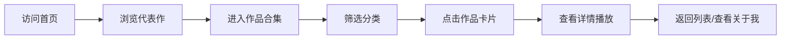

## 1. 产品概述
一款轻量化个人AI视频作品作品集官网，核心用途为对外展示个人AI视频创作成果，面向客户、同行、好友展示个人创作能力，主打简洁、高级、沉浸式观看体验。

- 目标用户：潜在合作客户、行业同行、意向观摩人员、社交引流来访用户
- 市场价值：个人AI创作能力的线上名片，低成本展示平台

## 2. 核心功能

### 2.1 用户角色
| 角色 | 注册方式 | 核心权限 |
|------|----------|----------|
| 浏览用户 | 无需注册 | 浏览作品、观看视频、筛选分类 |
| 管理员 | 本地运维 | 新增/编辑/删除作品、修改个人信息 |

### 2.2 功能模块
1. **首页**：导航栏、Hero区域、代表作展示、页脚
2. **作品合集页**：分类筛选、视频卡片网格、悬浮效果
3. **作品详情播放页**：视频播放、作品介绍、创作思路
4. **关于我页**：个人简介、创作经历、联系方式
5. **404页面**：错误提示、返回首页

### 2.3 页面详情
| 页面名称 | 模块名称 | 功能描述 |
|----------|----------|----------|
| 首页 | Hero区域 | 个人创作slogan、核心能力简介 |
| 首页 | 代表作展示 | 精选3-5个代表作置顶展示 |
| 作品合集页 | 分类筛选 | 按视频类型、AI模型筛选作品 |
| 作品合集页 | 卡片网格 | 视频封面、标题、时间、AI技术标注 |
| 作品详情页 | 视频播放 | 全屏播放、暂停、进度拖拽 |
| 作品详情页 | 作品介绍 | 详细介绍、创作思路、使用工具 |
| 关于我页 | 个人简介 | 创作经历、擅长领域、服务方向 |

## 3. 核心流程
用户访问首页 → 浏览代表作 → 点击进入作品合集 → 筛选分类 → 点击卡片查看详情 → 在线播放视频 → 返回或查看关于我

## 4. 用户界面设计

### 4.1 设计风格
- 主色：深空灰/科技蓝
- 辅助色：浅白、淡灰
- 点缀色：高亮蓝（按钮、选中状态）
- 字体：现代无衬线字体，清晰易读
- 布局：极简卡片式，充足留白

### 4.2 页面设计概览
| 页面名称 | 模块名称 | UI元素 |
|----------|----------|--------|
| 首页 | Hero区域 | 渐变背景、大标题、CTA按钮 |
| 作品合集页 | 卡片网格 | 响应式网格、hover放大效果、阴影加深 |
| 作品详情页 | 播放区域 | 全屏播放器、无广告干扰 |
| 关于我页 | 个人介绍 | 简洁排版、社交链接 |

### 4.3 响应式设计
- 桌面优先设计
- 移动端自适应布局
- 触摸操作优化
- 按钮尺寸适配手机点击

### 4.4 交互细节
- 作品卡片hover轻微放大、阴影加深
- 视频加载占位动画
- 页面平滑滚动
- 移动端触摸优化
