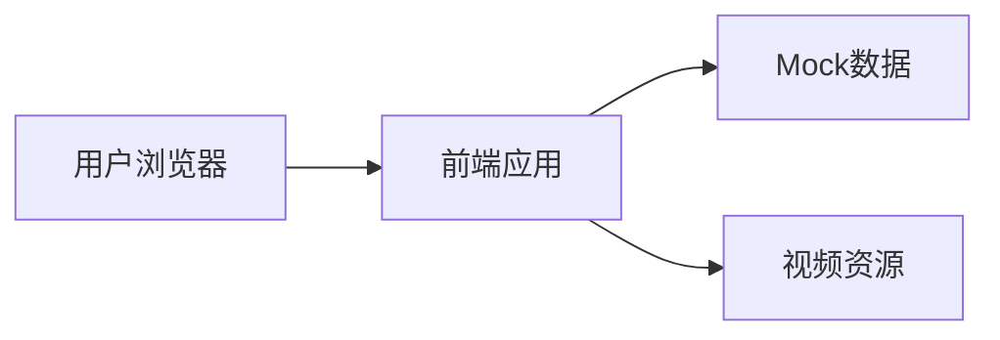

## 1. 架构设计


## 2. 技术描述
- 前端：React@18 + TailwindCSS@3 + Vite
- 构建工具：Vite
- 路由：React Router DOM
- 图标：Lucide React
- 数据：Mock数据（JSON文件）

## 3. 路由定义
| 路由 | 用途 |
|------|------|
| / | 首页 |
| /portfolio | 作品合集页 |
| /portfolio/:id | 作品详情播放页 |
| /about | 关于我页 |
| /* | 404页面 |

## 4. 数据模型

### 4.1 作品数据模型
```typescript
interface VideoWork {
  id: string;
  title: string;
  description: string;
  coverUrl: string;
  videoUrl: string;
  category: string;
  aiModel: string;
  createdAt: string;
  tags: string[];
  details: {
    concept: string;
    tools: string[];
    scene: string;
  };
}
```

### 4.2 个人信息数据模型
```typescript
interface Profile {
  name: string;
  title: string;
  slogan: string;
  bio: string;
  skills: string[];
  experience: string;
  contact: {
    email: string;
    social: { name: string; url: string }[];
  };
}
```

### 4.3 分类数据模型
```typescript
interface Category {
  id: string;
  name: string;
  icon: string;
}
```

## 5. 项目结构
```
src/
├── components/
│   ├── Navbar.tsx
│   ├── Footer.tsx
│   ├── VideoCard.tsx
│   ├── VideoPlayer.tsx
│   ├── HeroSection.tsx
│   └── CategoryFilter.tsx
├── pages/
│   ├── Home.tsx
│   ├── Portfolio.tsx
│   ├── PortfolioDetail.tsx
│   ├── About.tsx
│   └── NotFound.tsx
├── data/
│   ├── works.ts
│   ├── profile.ts
│   └── categories.ts
├── App.tsx
├── main.tsx
└── index.css
```
